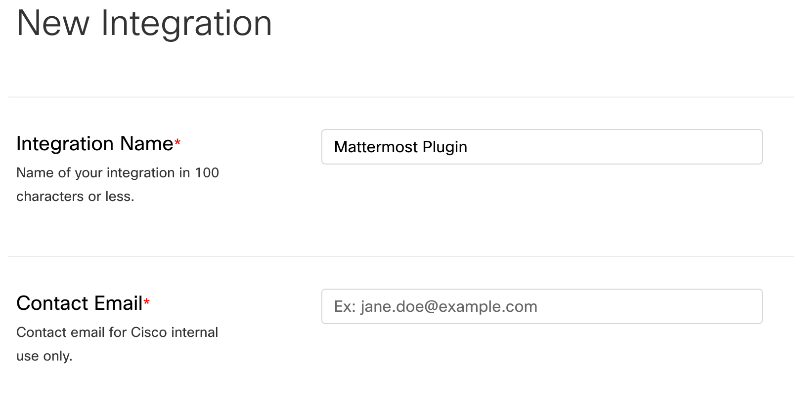
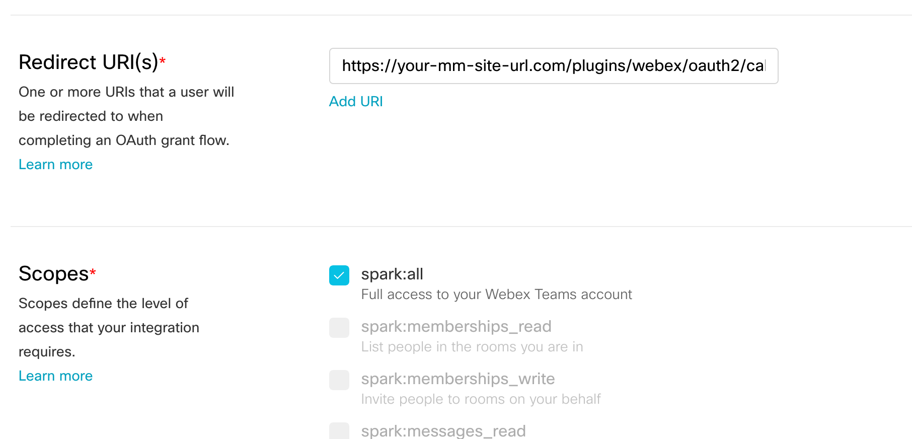
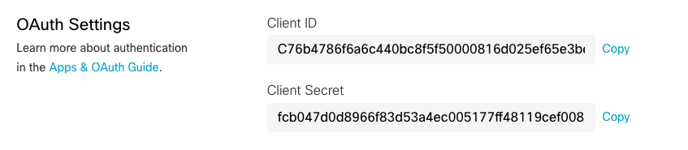

# mattermost-plugin-webex 

This plugin will add UI for users to start new Webex Teams (Cloud) call/meeting with another user. (WIP)

### Prerequisites
You will need an existing admin account for Webex Teams in order to create an integration. 

#### Create Webex Integration

Connecting Mattermost users to their Webex accounts requires [creating an integration](https://developer.webex.com/my-apps/new/integration).  



Fill out the appropriate fields with the relevant info, but be sure that the Redirect URI(s) includes your Site URL and full URI for the OAuth2 callback:

_https://your-mattermost-site-url/plugins/webex/oauth2/callback_



Additionally for scopes select ```spark:all``` and scroll on down to submit _Add Integration_

## Installation

Go to the [releases page of this Github repository](https://github.com/mattermost/mattermost-plugin-webex/releases) and download the latest release for your server architecture. You can upload this file in the Mattermost system console to install the plugin.


## Configuration 

The configuration is fairly simple once you've created an integration.  After you _Add Integration_ you'll be given a Client ID and a Client Secret listed under 'OAuth Settings'. 



Use these to set the **OAuth Client ID** and **OAuth Client Secret** under the System Console in Mattermost (Main Menu > System Console > Plugins > Webex).  Be sure to generate an excryption key as well.  


## Developing

This plugin contains both a server and web app portion.

Use `make dist` to build distributions of the plugin that you can upload to a Mattermost server for testing.

Use `make check-style` to check the style for the whole plugin.

Use `make deploy` with Environment variables `MM_SERVICESETTINGS_SITEURL`, `MM_ADMIN_USERNAME` and `MM_ADMIN_PASSWORD` to deploy directly to a running server. 

```
MM_SERVICESETTINGS_SITEURL=http://localhost:8065 \
MM_ADMIN_USERNAME=marty \
MM_ADMIN_PASSWORD=password \
make deploy
```
